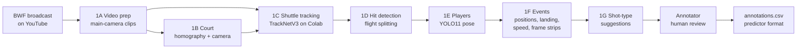
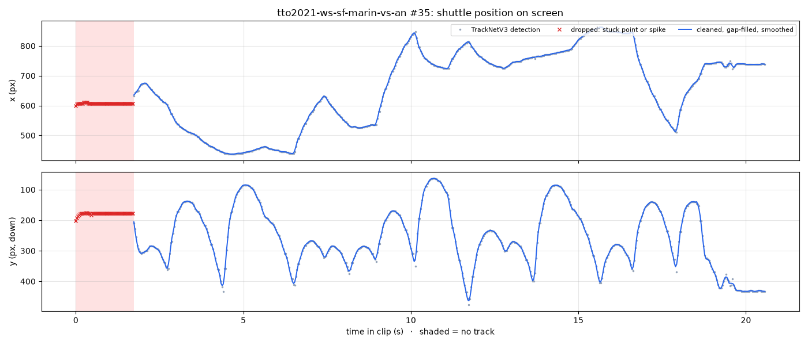
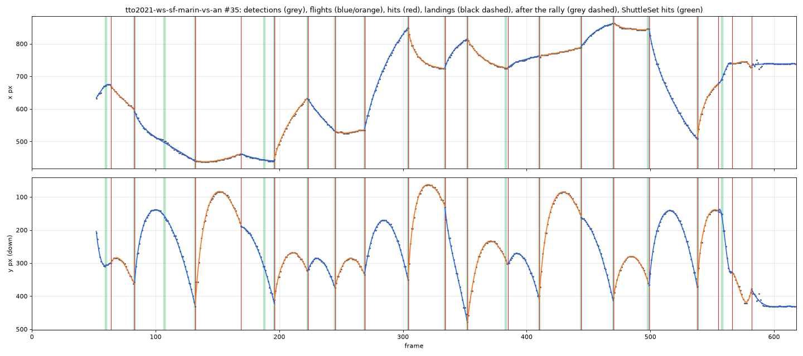

# BadmintonEncoder

## TL;DR

- **What:** turns BWF broadcast video into shot-by-shot rally data (who hit it, the shot type, where it landed), in exactly the format [BadmintonShotPredictor](#related-projects) trains on.
- **How:** a Python pipeline measures everything from the video: main-camera clips, court calibration, shuttle tracking with TrackNetV3, hit detection, player pose, and one event per shot with positions, landing, speed and frames.
- **Labelling:** a classifier trained on ShuttleSet suggests each shot type (70-74% right first time, 92% in its top 3), and a person confirms or corrects every shot in a keyboard-driven React app, at about 1,100 shots an hour.
- **First result:** trained only on 24 labelled rally pieces, the predictor scores 44.5% on ShuttleSet's validation games, against 38.9% for the same amount of ShuttleSet data. The labels hold up; the amount of data is what limits it.
- **Run it:** `npm run dev` for the annotator; the pipeline scripts are in [`pipeline/`](pipeline/) ([how to run](#running-it)).

## Overview

Turns broadcast badminton video into shot-by-shot rally data: for every shot, who hit it, what kind of shot it was and where it went. The output is training data for [BadmintonShotPredictor](#related-projects), a small transformer that predicts the next shot in a rally.

The predictor was built on [ShuttleSet](https://github.com/wywyWang/CoachAI-Projects/tree/main/ShuttleSet), a hand-labelled dataset of 44 BWF matches. Labelling a match by hand, frame by frame, takes hours, which caps how much data there can ever be. This project does most of that work from the video. A pipeline finds each hit, where both players stand, where the shuttle lands and how fast it travels, and suggests a shot type. A person then confirms or corrects each shot in a keyboard-driven review app, which exports the rallies in exactly the format the predictor trains on.

It has two parts:

- **The pipeline** ([`pipeline/`](pipeline/)): Python scripts that go from a YouTube match to a list of detected shots ("events") with measurements and cropped frames.
- **The annotator** (repo root): a single-file React app for reviewing those events and exporting the predictor's `train.csv` format.

## How it works



The stage names (1A to 1G) are used throughout the scripts and docs. [pipeline/README.md](pipeline/README.md) documents every stage in detail: the algorithm, each threshold and the measurement behind it, outputs and known limits.

| Stage | Script | What it does | Measured |
|---|---|---|---|
| 1A Video prep | `video_prep.py` | Downloads a match at 720p, finds the main (wide, behind-the-baseline) camera by clustering frames, and cuts every stretch of it into its own clip. The full download is then deleted. | 8 matches → 696 clips, 3.1 hours of main-camera footage |
| 1B Court | `court_calibrate.py` | Builds a median frame per match, detects the painted lines and fits the image-to-court homography automatically, then recovers the camera (focal length, position) from it. | All 8 matches pass: at least 10 of 12 lines found, each within 10 px; typical error 1-4 px |
| 1C Shuttle | `shuttle_track.py` + Colab notebook | Runs TrackNetV3 on a Colab GPU, then removes its artifacts (a fixed "stuck" position it reports when it sees nothing, single-frame spikes), fills short gaps and smooths the track. | Shuttle found a median 94.7% of the time while in play; 90% of clips above 70% |
| 1D Hits | `contact_detect.py` | Splits each clip's track into the flights that explain it best (drag-model curve fits, chosen by dynamic programming); a cut where the velocity jumps is a hit. The first floor contact ends the rally. | Against ShuttleSet's labelled hits (±2 frames): recall 79-84%, precision 83-84% on held-out matches |
| 1E Players | `player_detect.py` | Runs YOLO11 pose on each hit and the frames around it, puts both players' feet on the court, and names the hitter as the player whose wrist is nearest the shuttle. | Right hitter at 98.1% of ShuttleSet's hits |
| 1F Events | `feature_assemble.py` | Builds one event per hit: both players' positions, where the shot went, its speed and launch angle, timings, and cropped frame strips. Tells the two players apart by shirt colour. | Landing a median 1.0-1.1 m from ShuttleSet's; player names right at 97.8-98.6% of hits |
| 1G Suggestions | `shot_classify.py` | A gradient-boosted classifier trained on ShuttleSet's own 29,494 labelled shots suggests each event's shot type. | On the pipeline's events: 70-74% first guess, 92% in its top 3 |

### What tracking and hit detection look like

Both charts show the same rally: clip 35 of Carolina Marín vs An Se Young (Thailand Open 2021 semi-final), one of the ShuttleSet matches held out from tuning, so ShuttleSet's hand-labelled hits can be drawn alongside. It's a typical rally, not a best case: 1D found 15 of its 19 labelled hits within ±2 frames (79%, the same as the match overall). The charts come from `shuttle_track.py plot` and `contact_detect.py plot`; they show positions on screen, not video frames.

**Shuttle tracking (1C).** The shuttle's position on screen through the rally: TrackNetV3's detections (grey), the ones cleaning dropped as its "stuck point" artifact or as one-frame spikes (red ×), and the cleaned, gap-filled, smoothed track that hit detection reads (blue). Shaded stretches have no track. In the first 1.7 s, before the shuttle is in view, TrackNetV3 reports its fixed stuck point, and cleaning drops all of it. Each rise and fall in *y* after that is one shot's flight.



**Hit detection (1D).** The same track by frame, split into flights (blue and orange alternate): each flight is one curve fitted with a drag model, and the cuts between them where the velocity jumps are the detected hits (red lines). ShuttleSet's hand-labelled hits are the green bands. Most red lines sit on a green band. The misses are green bands with no red line. The last two red lines come after ShuttleSet's final hit, as the shuttle comes down: false hits, the kind the reviewer marks with X.



### A few ideas that run through it

- **Everything is in court coordinates.** 1B's homography maps any floor point in the image to metres on the court (X across, Y along, net at 0). It only maps floor points, so players are placed by their feet, and a shuttle's position counts only when it touches the floor. An airborne shuttle projects to wherever the camera's line of sight meets the floor.
- **"Landing" means what ShuttleSet means.** For a returned shot, the landing is where the next player hits it, not where it would have bounced. 1F takes the floor point under the shuttle at the next hit; for a rally's last shot, where it hit the floor.
- **A landing on the hitter's own half is never accepted.** A shot has to cross the net, so such a landing means the landing is wrong or one of the hits is false (two hits in a row on one side). About 18% of the pipeline's returned shots have one. The classifier ignores those landings, the annotator flags the shot, and the export leaves it out until the review fixes it.
- **Who is who, per match.** 1E knows which half the hitter is on, but players change ends. Their shirts don't, so 1F clusters shirt colours into two players and decides which one is on the near half for the whole match at once: at most 3 end changes, each at a break long enough to be an interval between games. Clip by clip, similar shirts (red against pink) had flipped the names 17 times in one match.
- **Suggestions in ShuttleSet's own terms.** The classifier learns from the predictor's own training data, so it uses exactly the predictor's 10 shot types and ShuttleSet's conventions for them (a lob is hit from the front court, a clear from the back). It sees what the pipeline measures: where the hitter, opponent and landing are, the time to the next hit and the speed that implies, and where the previous hitter stood. It's trained on each ShuttleSet shot twice, once clean and once with the pipeline's measured errors added, which took its accuracy on real pipeline events from 62% to 69% on the tuning match.

## The annotator

`npm run dev` serves the app at http://localhost:5173 and loads `data/events.json` from the pipeline (mock events if it's missing). For each detected shot it shows:

- **A 3D court** on the left: both players at their measured positions, named, the landing point, and an arc for the shot type. The arc's height is a per-type sketch; its start and end are measured. Views: broadcast, side and top.
- **Two frame strips** on the right, each on a fixed row per player (the first-named player always on top): this shot's contact and the next shot's contact, which is where this shot went. After a rally's last shot, the second row shows the whole court 0.5, 1 and 1.5 s later instead.
- **The suggestion** between the strips: the suggested shot type, its probability (green at 70% or above) and the next two alternatives.

Reviewing is one key per shot:

| Key | Action |
|---|---|
| Enter | Accept the suggestion |
| 1-9, 0 | Pick one of the 10 shot types |
| X | Not a shot: a false hit from 1D. It's dropped, and the shot before takes its landing |
| G | A shot is missing before this one: the rally is split here |
| L | Move the landing (click or drag on the court) |
| U | Undo this shot's label |
| ← → / Backspace | Move between shots |

A match picker reviews one match at a time. The review is saved on every key: to the browser, to `review.json` on disk, and as the export `annotations.csv`. A save that would shrink `review.json` by more than 5 shots first copies the old file aside, and a tab that sees another tab save stops saving, so an old tab can't overwrite newer work. Reset clears everything after asking.

## The export

`annotations.csv` must load in the predictor unchanged, so it matches its `train.csv` exactly: `rally_id, ball_round, player, type, landing_x, landing_y, rally_length`.

- **Shot types** are the predictor's 10 strings: short service, long service, net shot, lob, clear, drop, smash, drive, push/rush, defensive shot.
- **Only fully reviewed rallies are exported**, split into pieces wherever the sequence can't be trusted. The predictor learns shot-to-next-shot transitions, so a gap would teach a transition that never happened. A missing shot (G) or a shot landing on its own half splits the rally; a false hit (X) is dropped. Pieces under 5 shots are left out, since the predictor never scores a rally's first 3 positions.
- **Landings** are in ShuttleSet's court template, `((px − 175)/82, (py − 467)/192)`.
- **Players** use the predictor's ids 0-34, recovered by rebuilding ShuttleSet22's numbering. A rally with a player outside those 35 is left out, because the predictor's player embedding has no row for them. Of the current matches, that's Christo Popov's.
- **`rally_id`** = 10000 + rally index × 100 + piece, which keeps ids stable and clear of the predictor's.

## Results so far

**Review speed and the suggestions.** On 292 reviewed shots from 28 rallies of Shi Yu Qi vs Jonatan Christie (Denmark Open 2025 final):

- A median of 1.7 s per shot, about 1,100 shots an hour.
- The reviewer kept the suggestion on 85% of shots; on 91% where it was at least 70% confident, which is three shots in four. The right type was in its top 3 on 95%.
- 16% of detected hits were false and marked X.

**Training the predictor on the labels alone.** `annotated_experiment.py` in the predictor repo trains the predictor from scratch on `annotations.csv` only, with no ShuttleSet data, and scores it on the predictor's own ShuttleSet validation split (350 rallies, 2,970 scored transitions), averaged over 3 runs. From the first 24 labelled rally pieces (107 scored transitions):

| Trained on | Next-shot accuracy |
|---|---|
| The labelled rallies (the predictor's transformer) | 44.5% at the end of training, 48.9% at its best |
| As many ShuttleSet rallies (same model) | 38.9% at the end, 41.1% at its best |
| Commonest next shot, counted from the labelled rallies | 52.1% |
| Commonest next shot, counted from all 2,268 ShuttleSet training rallies | 55.9% |
| Always "net shot" | 23.7% |

With about 5% of ShuttleSet's data, the labels' shot-to-next-shot table comes within 4 points of ShuttleSet's full one, and the transformer trained on them beats one trained on the same amount of ShuttleSet. The labels carry ShuttleSet's structure; the amount of data is what limits the model (it reaches 97% on its own training rallies and overfits after about 250 steps).

## Running it

**Annotator** (Node, Vite, React 19):

```bash
npm install
npm run dev      # http://localhost:5173; saves review.json and annotations.csv to disk as you go
npm run build
```

**Pipeline** (Python; needs `ffmpeg`, and Node on the `PATH` for yt-dlp). Run from `pipeline/`, since the scripts import each other by module name:

```bash
cd pipeline
python3 -m venv .venv && .venv/bin/pip install -r requirements.txt
.venv/bin/python video_prep.py [--match <id>]                     # 1A clips
.venv/bin/python court_calibrate.py [--match <id>] [--click]       # 1B court
.venv/bin/python shuttle_track.py pack                             # 1C: zip clips for Colab, run the notebook, then:
.venv/bin/python shuttle_track.py ingest <zip> && .venv/bin/python shuttle_track.py process
.venv/bin/python contact_detect.py labels|detect|evaluate          # 1D hits
.venv/bin/python player_detect.py detect|evaluate                  # 1E players
.venv/bin/python feature_assemble.py assemble|validate|evaluate    # 1F -> data/events.json
.venv/bin/python shot_classify.py train|evaluate|label             # 1G suggestions (label again after every assemble)
```

Matches are rows in [`pipeline/matches.csv`](pipeline/matches.csv). Three of them are ShuttleSet matches, used only to measure the pipeline against human labels: one for tuning, two held out. They're kept out of `events.json` because ShuttleSet is the predictor's own training data. Shuttle tracking runs TrackNetV3 in [`pipeline/colab/tracknet_colab.ipynb`](pipeline/colab/tracknet_colab.ipynb) on a free T4 GPU, about 7 frames per second. 1E and 1F run pose on the Mac's GPU.

**Predictor experiment**, from the BadmintonShotPredictor repo:

```bash
.venv/bin/python annotated_experiment.py [--csv path/to/annotations.csv] [--seeds 3] [--iters 2000]
```

## Repository layout

```
badminton-annotator.jsx   the annotator (one file: court renderer, review, export)
main.jsx, index.html      entry point; main.jsx maps the app's storage onto localStorage
vite.config.js            dev server, plus the endpoints that save review.json and annotations.csv
annotations.csv           the export, in the predictor's train.csv format
pipeline/                 stages 1A-1G, matches.csv, the Colab notebook, and pipeline/README.md
data/                     clips, tracks, events and model files (not in git)
```

Per match, the pipeline writes to `data/segments/<match_id>/`: the clips, `court.json`, tracks, contacts, players, `identity.json` and the frame strips. Data lives in `../data` by default, or `$BADMINTON_DATA_DIR`.

## Limitations

- **Serves are often missing.** Broadcasts usually show the serve on a close-up and cut to the main camera just after, so about half the clips start mid-rally. Rallies are exported in pieces for this reason.
- **Hit detection misses about one hit in six** on held-out matches, mostly far-player hits and splits the flight fit didn't make; the reviewer adds them back with G. Far-side landings are the weakest measurement: a shuttle on the floor and one on a racket map to the same place.
- **Suggestions are weakest** on drive, push/rush against lob, and a net shot against a blocked smash (a "defensive shot" in ShuttleSet's terms). Every exported label is checked by a person.
- **Players outside the predictor's 35** can be reviewed but not exported until the predictor's player embedding grows.
- **Single camera, 720p, 30 fps**, and one homography per match, which assumes the main camera doesn't move.

## Data and copyright

The clips come from copyrighted BWF broadcasts and are kept locally for personal research only. None of them are in this repository; `data/` is excluded from git.

## Related projects

- **BadmintonShotPredictor**: the next-shot transformer this data is for.
- **[ShuttleSet](https://github.com/wywyWang/CoachAI-Projects/tree/main/ShuttleSet)**: the labelled BWF matches used for training the classifier and measuring the pipeline.
- **[TrackNetV3](https://github.com/qaz812345/TrackNetV3)**: the shuttle tracker used in 1C.
